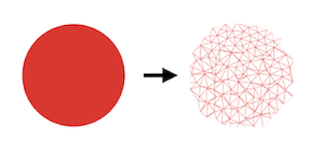

```{r setup, include=FALSE}
knitr::opts_chunk$set(echo = FALSE, warning = FALSE, message = FALSE)
knitr::opts_knit$set(global.par = TRUE)
```


# triangleart

This started as an attempt to create my own [triangle mesh](https://en.wikipedia.org/wiki/Triangle_mesh), a type of [low poly](https://en.wikipedia.org/wiki/Low_poly) that has many applications particularly in computer graphics. It occurred to me that it could be used for quilt design, and indeed it's been done, and [blogged about](http://gefiltequilt.blogspot.com/2015/12/triangle-quilt-design-with-low-poly.html). The easy way would be to upload photos to [site mentioned in the post](https://snorpey.github.io/triangulation/) and convert them to low poly:

```{r, out.width='40%'}

```

But I wanted more control. I found an R package to create meshes but there was no obvious way to customize plots (I'll return to R options later.) How hard could it be to connect dots to make triangles? A toddler could do it! 

```{r, fig.width = 3, fig.height = 3, out.width="20%"}
library(triangleart)
library(deldir)
par(mar = c(2, 2, 2, 2))
df <- generate_data()
plot(df$x, df$y, axes = FALSE, ann = FALSE, asp = 1, pch = 16)
plot(df$x, df$y, axes = FALSE, ann = FALSE, asp = 1, pch = 16, cex = .9)
plot(triang.list(deldir(df$x, df$y)), add=TRUE)
mtext(text = expression(italic("Simple triangle mesh")), 1, at = 2)
```


Well, a lot harder than it looks. But it was fun to experiment without any packages or complex algorithms and see what I could do with some simple principles. 

### First attempt

My first algorithm involved choosing a starting point *i* (#8 in the diagram below)--I experimented with different options--and then forming the first triangle with the closest point to it *i2* (#4) and then the closest point to that point *i3* (#3). 

Next we find the closest point to *i3*, call it *p* (#7) and draw line segments to any vertex of the first triangle as long as the segment doesn't intersect a side of the triangle. For example, #7-#3 and #7-#8 don't intersect, so those line segments between those pairs of points will be drawn but #7-#4 will not, since a line segment through those points would intersect #3-#8. (Line segments will intersect if the endpoints of each lie on opposite sides of the line through the other two points.)

```{r, fig.width = 3, fig.height = 3, out.width="20%"}
plot(df$x, df$y, axes = FALSE, ann = FALSE, asp = 1, pch = 16, cex = .9)
mtext(text = expression(italic("the grid")), side = 1)
simple(tlab = TRUE, np = 10)
mtext(text = expression(italic("starts out fine")), side = 1)
simple(tlab = TRUE, np = 11)
mtext(text = expression(italic("closest point (in red) is far\nfrom the last drawn triangle")), side = 1, line = 1)
simple(tlab = TRUE, np = 12)
mtext(text = expression(italic("algorithm fails")), side = 1)
simple(tlab = TRUE)
mtext(text = expression(italic("complete")), side = 1)
```


```{r, fig.height=1, fig.width=5, out.width='50%'}
par(mar = c(0,0,1,0))
par(mfrow=c(1, 4))
# colors from: https://lospec.com/palette-list/manuscript-mmxx
colors <- c("#d5cfb7", "#bdb5a3", "#cfb57a", "#c79a4d",
                   "#a78135", "#e8d573", "#e5b297", "#c4483b",
                   "#963317", "#b2bd8f", "#4c6f4f", "#213e28",
                   "#0e2e34", "#254b50", "#2e6c84", "#88b6bf")
for (i in (1:16)) {
  simple(i = i, col = colors[i])
  title(i)
}
  
```


The new triangle (#3-#7-#8) becomes the current one. We look for the closest point to #7 and repeat the process. This method starts out ok, but runs into trouble once we've used all the n


