triangleart
================

This started as an attempt to create my own [triangle
mesh](https://en.wikipedia.org/wiki/Triangle_mesh), a type of [low
poly](https://en.wikipedia.org/wiki/Low_poly) that has many applications
particularly in computer graphics. It occurred to me that it could be
used for quilt design, and indeed it’s been done, and [blogged
about](http://gefiltequilt.blogspot.com/2015/12/triangle-quilt-design-with-low-poly.html).
The easy way would be to upload photos to [site mentioned in the
post](https://snorpey.github.io/triangulation/) and convert them to low
poly:

But I wanted more control. I found an R package to create meshes but
there was no obvious way to customize plots (I’ll return to R options
later.) How hard could it be to connect dots to make triangles?

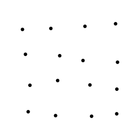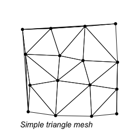

Well, a lot harder than it looks. But it was fun to experiment without
any packages or complex algorithms and see what I could do with some
simple principles.

### First attempt

My first algorithm involved choosing a starting point *i* (#8 in the
diagram below)–I experimented with different options–and then forming
the first triangle with the closest point to it *i2* (#4) and then the
closest point to that point *i3* (#3).

Next we find the closest point to *i3*, call it *p* (#7) and draw line
segments to any vertex of the first triangle as long as the segment
doesn’t intersect a side of the triangle. For example, \#7-#3 and \#7-#8
don’t intersect, so those line segments between those pairs of points
will be drawn but \#7-#4 will not, since a line segment through those
points would intersect \#3-#8. (Line segments will intersect if the
endpoints of each lie on opposite sides of the line through the other
two points.)

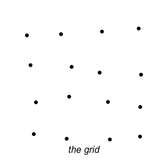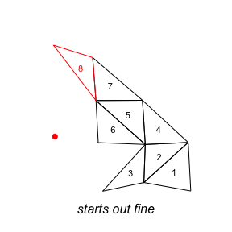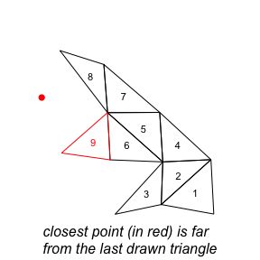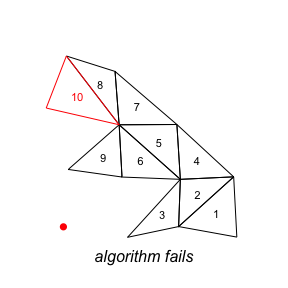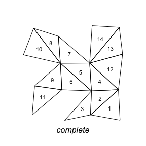

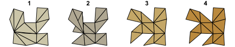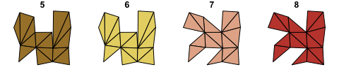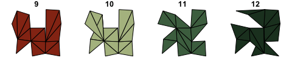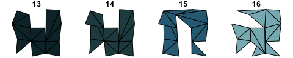

The new triangle (#3-#7-#8) becomes the current one. We look for the
closest point to \#7 and repeat the process. This method starts out ok,
but runs into trouble once we’ve used all ….

(to be continued)
