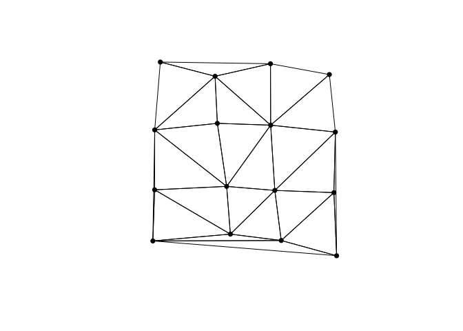

# triangleart

This started as an attempt to create my own [triangle
mesh](https://en.wikipedia.org/wiki/Triangle_mesh), a type of [low
poly](https://en.wikipedia.org/wiki/Low_poly) that has many applications
particularly in computer graphics. It occurred to me that it could be
used for quilt design, and indeed it’s been done, and [blogged
about](http://gefiltequilt.blogspot.com/2015/12/triangle-quilt-design-with-low-poly.html).
The easy way would be to upload photos to [site mentioned in the
post](https://snorpey.github.io/triangulation/) and convert them to low
poly:


But I wanted more control. I found an R package to create meshes but
there was no obvious way to customize plots (I’ll return to R options
later.) How hard could it be to connect dots to make triangles? A
toddler could do it!

<figure>
<figcaption aria-hidden="true"><em>Simple triangle mesh with 16 points</em></figcaption>
</figure>

``` r
library(triangleart)
library(deldir)
```

    ## deldir 1.0-6      Nickname: "Mendacious Cosmonaut"

    ## 
    ##      The syntax of deldir() has had an important change. 
    ##      The arguments have been re-ordered (the first three 
    ##      are now "x, y, z") and some arguments have been 
    ##      eliminated.  The handling of the z ("tags") 
    ##      argument has been improved.
    ##  
    ##      The "dummy points" facility has been removed. 
    ##      This facility was a historical artefact, was really 
    ##      of no use to anyone, and had hung around much too 
    ##      long.  Since there are no longer any "dummy points", 
    ##      the structure of the value returned by deldir() has 
    ##      changed slightly.  The arguments of plot.deldir() 
    ##      have been adjusted accordingly; e.g. the character 
    ##      string "wpoints" ("which points") has been 
    ##      replaced by the logical scalar "showpoints". 
    ##      The user should consult the help files.

``` r
df <- generate_data()
plot(df$x, df$y, axes = FALSE, ann = FALSE, asp = 1, pch = 16)
plot(df$x, df$y, axes = FALSE, ann = FALSE, asp = 1, pch = 16)
plot(triang.list(deldir(df$x, df$y)), add=TRUE)
```



Well, a lot harder than it looks. But it was fun to experiment without
any packages or complex algorithms and see what I could do with some
simple principles.

### First attempt

My first algorithm involved choosing a starting point *i* (#8 in the
diagram below)–I experimented with different options–and then forming
the first triangle with the closest point to it *i2* (#4) and then the
closest point to that point *i3* (#3).

Next we find the closest point to *i3*, call it *p* (#7) and draw line
segments to any vertex of the first triangle as long as the segment
doesn’t intersect a side of the triangle. For example, #7-#3 and #7-#8
don’t intersect, so those line segments between those pairs of points
will be drawn but #7-#4 will not, since a line segment through those
points would intersect #3-#8. (Line segments will intersect if the
endpoints of each lie on opposite sides of the line through the other
two points.)

``` r
simple(tlab = TRUE)
```

<!-- -->


The new triangle (#3-#7-#8) becomes the current one. We look for the
closest point to #7 and repeat the process. This method starts out ok,
but runs into trouble once we’ve used all the n


